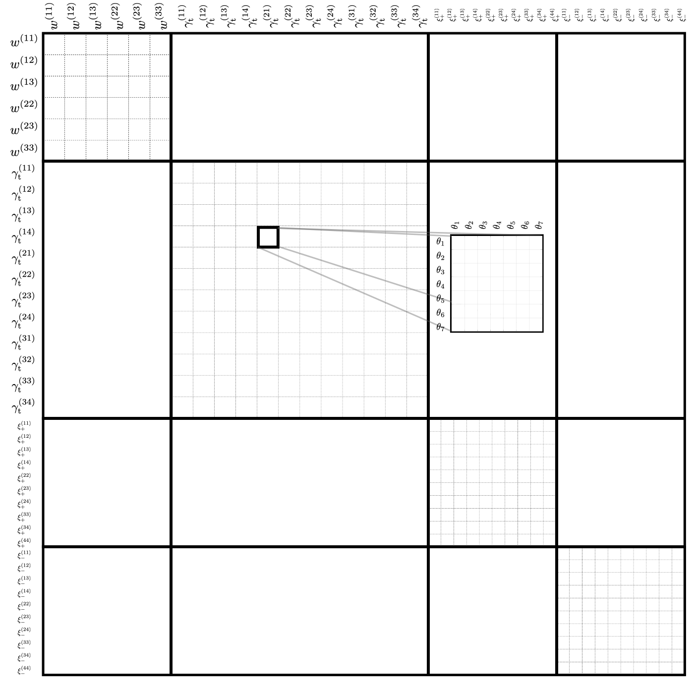

Crash course
============
Running the code with the unaltered ``config.ini`` will calculate the Gaussian real-space covariance matrix for a KiDS-1000 setting for a 3x2pt analysis
including photometric galaxy clustering, :math:`w(\theta)`, galaxy-galaxy-lensing, :math:`\gamma_\mathrm{t}(\theta)` and cosmic shear, 
:math:`\xi_{\pm}(\theta)`. Running the code will produce several files in the ``output`` directory:

- A plot ``correlation_coefficient.pdf`` of the correlation coeffcient of the covariance matrix.
- A text file in matrix format ``covariance.mat`` including the desired covariance matrix which can be used directly. The priority is always the following (from the slowest to the fastest index):
  Of course if a certain probe does not exist it is ignored. Furthermore, galaxy clustering and cosmic shear have :math:`n(n+1)/2` unique observables if :math:`n` is the number of tomographic lens and 
  source bins respectively. Galaxy-galaxy-lensing on the other hand has :math:`n_\mathrm{lens}n_\mathrm{source}` unique observables.
- A text file in a list format ``covariance.dat`` including all entries of the covariance matrix labeled by probe, tomographic bin combination and projected quantity.

We show an example structure of the order in the ``covariance.mat`` file and the corresponding ``correlation_coefficient.pdf`` plot for :math:`n_\mathrm{lens}=3` and :math:`n_\mathrm{source}=4` below:

Here realspace statistics where used. The order for the Fourier counterparts (bandpowers or C_ells) is, however, the same. If any probe is not required it is just removed from this diagram. In case you want
to rearrange the order it can be done using the output listed in ``covariance.mat`` or directly the listed values in ``covariance.dat``.

A quick look into the ini-file
-------------------------------
All parameters in the code can be changed in the ``config.ini``. In this section we want to take a closer look at a few of the important ones. For a detailed description of all of them, the ``config.ini`` itself
provides all the necessary details.

- **Cosmology:** The cosmology is specified in the ``[cosmo]`` section in the ini file. This provides the cosmological parameters (e.g. :math:`\sigma_8,\;h,\;w_0,\;\Omega_{\mathrm{m}0}, ...`) which are used to calculate the covariance matrix.
- **Covariance Terms:** The ``[covariance terms]`` section specifies which terms should be calculated. Note that the individual terms are only saved in the ``covariance.dat`` file. The ``covariance.mat`` file always contains the sum of all the terms which are supposed to be calcualted.
- **Observables:** The ``[observables]`` section specifies the observables for which the covariance should be calculated. E.g. which observable should be used for cosmic shear or clustering. 
- Specifying Observables:
    - ``[covELLspace settings]``: options for standard covariance in flat sky spherical harmonic space. Since this forms the basis of the estimator for all of the other observables, these settings are required.
    - ``[covTHETAspace settings]``: options for the real space covariance matrix
    - ``[covCOSEBI settings]``: options for the COSEBI covariance matrix (or any probe with the same integral shape)
    - ``[covbandpowers settings]``: options for the bandpower covariance matrix.
- Specifying the Survey::
    - ``[survey specs]``: which allows the definition of the survey area, the number density and shape noise properties. 
    - ``[redshift]``: allows the specification of the redshift distribution of sources and lenses. Note that we use zlens and zclust as labels respectively.
- **Other input files:** It is possible to pass different input files to the code, for example the angular power spectra. In this way the code only carries out the projection to the observable. 

Some examples
=============

KiDS-1000 covariance
--------------------
The standard ``config.ini`` (after you pulled the directory) will run a KiDS-1000 like setup. Not all parameters specified in the ``config.ini`` are used and it is merely used as an explanatory file to explain all the parameters which can be set.

