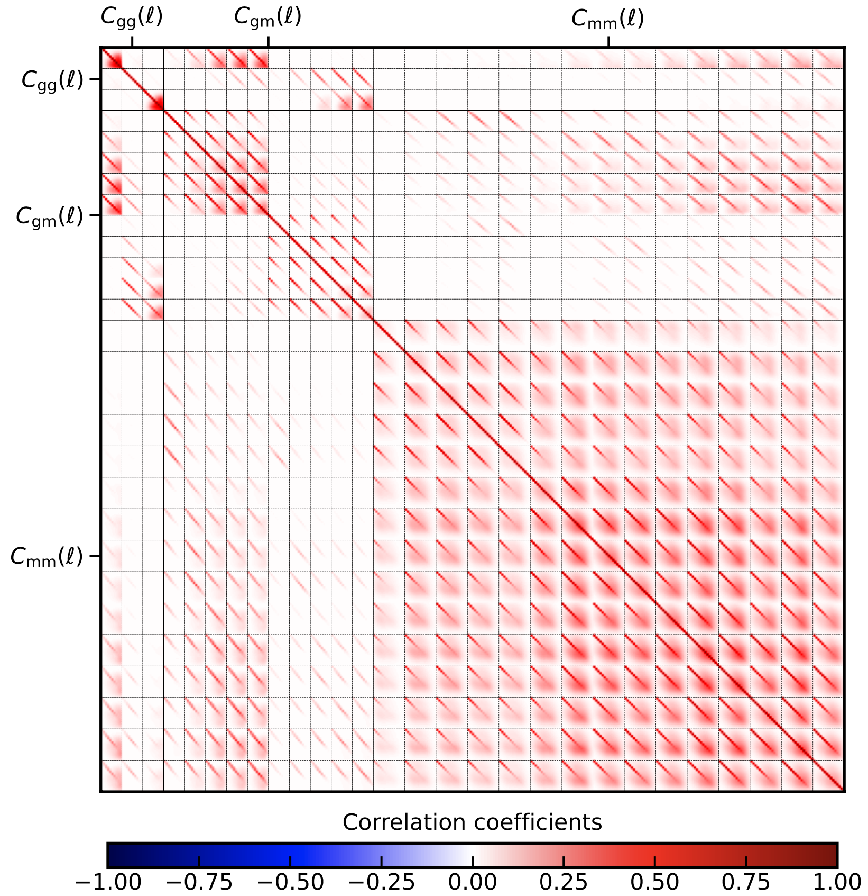
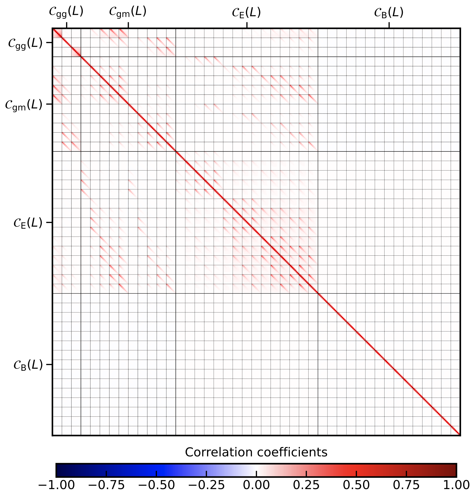
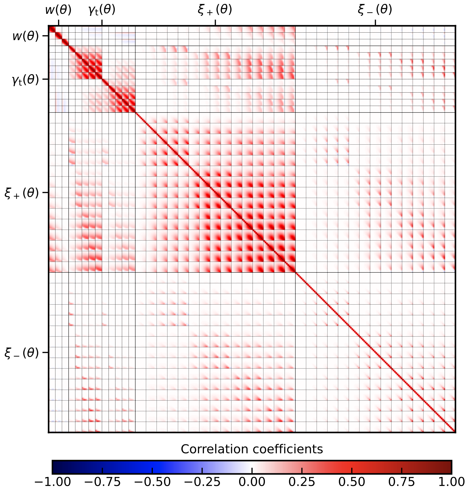
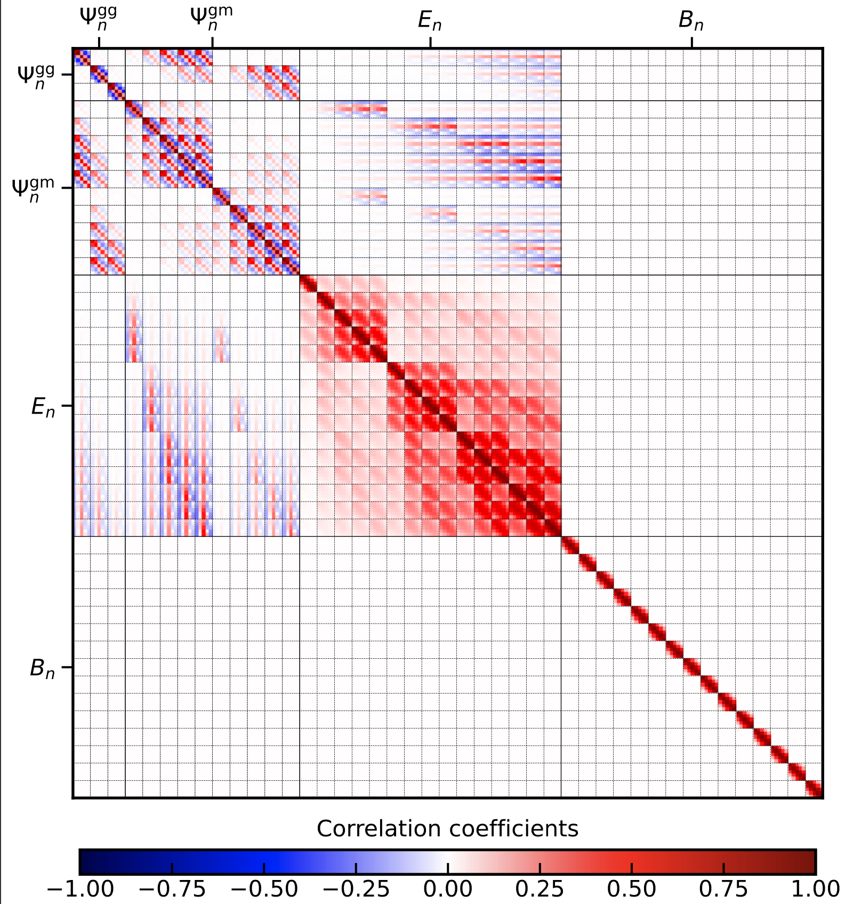
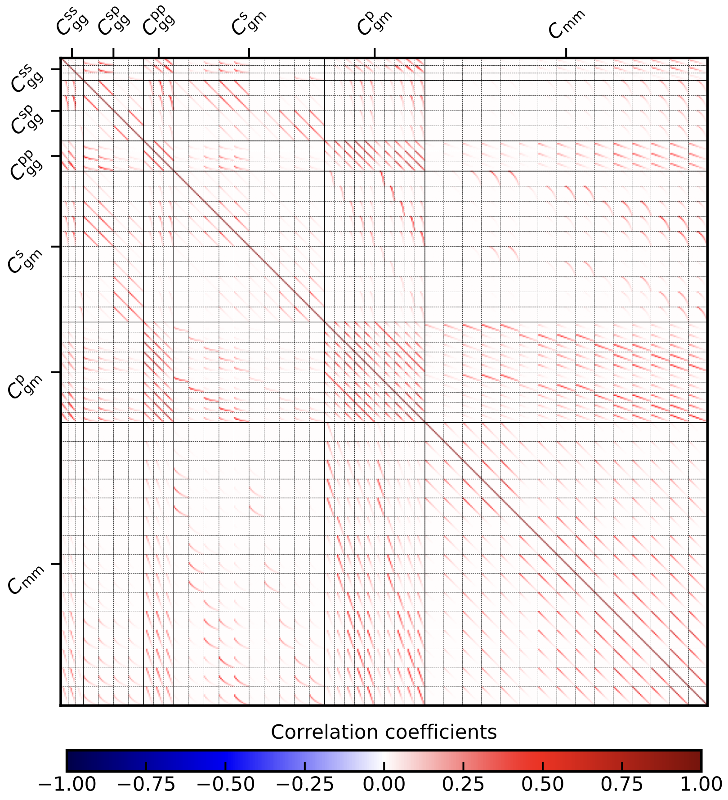
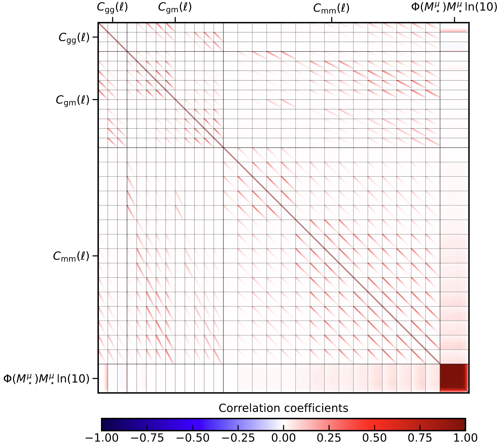

Basic Examples
==============

3x2pt for pure :math:`C_\ell`:
------------------------------
We will calculate the full 3x2pt covariance matrix in harmonic space by running the covariance code with the in ``config_3x2pt_pure_Cell.ini`` in the ``/config_files`` directory.
To obtain a good understanding, we will go through the ``.ini`` file section by section:

::

   [covariance terms]
   gauss = True
   split_gauss = True
   nongauss = True
   ssc = True

These settings ensure that all terms in the covariance are calculated, that is the Gaussian, non-Gaussian and super-sample covariance terms. The option ``split_gauss = True`` results into
a further splitting of the Gaussian term into sample-variance, mixed and shot-noise terms in the list output. 

::
 
   [observables]
   cosmic_shear = True
   est_shear = C_ell
   ggl = True
   est_ggl = C_ell
   clustering = True
   est_clust = C_ell
   cstellar_mf = False
   cross_terms = True
   unbiased_clustering = False

Clearly we have switched on all observables and choose ``C_ell`` as the required summary statistic. Furthermore, ``unbiased_clustering`` is ``False`` since a bias model will
be used to describe the clustering. Since we do not require the stellar mass function, it is set to ``False``. Setting ``cross_terms = True`` ensures that all cross-covariances
between the observables are calculated. 

::

   [output settings]
   directory = ./output/
   file = covariance_list.dat, covariance_matrix.mat
   style = list, matrix
   list_style_spatial_first = True
   corrmatrix_plot = correlation_coefficient.pdf
   save_configs = save_configs.ini
   save_Cells = True
   save_trispectra = False
   save_alms = True
   use_tex = False

This section specifies the output setting and is in general pretty self-explanatory. It should be said, however, ``list_style_spatial_first = True`` will lead to the spatial index,
:math:`\ell` in this case, to vary fastest in the list output.  Furthermore, ``save_alms = True`` ensures that the suvey modes of the SSC term are
saved on disk if a mask file is specified. ``use_tex = False`` is just for cosmetics of the output plot, only switch it on if ``LaTeX`` is installed.

::

   [covELLspace settings]
   delta_z = 0.08
   tri_delta_z = 0.5
   integration_steps = 500
   nz_interpolation_polynom_order = 1
   mult_shear_bias = 0, 0, 0, 0, 0
  
   ell_min_clustering = 2
   ell_max_clustering = 1000
   ell_bins_clustering = 10
   ell_type_clustering = log

   ell_min_lensing = 2
   ell_max_lensing = 5000
   ell_bins_lensing = 15
   ell_type_lensing = log

Here are the most important settings for the :math:`C_\ell`: covariance, apart from a few accuracy settings the multipole ranges for clustering and lensing are specified.
It should be noted that GGL always assumes the binning for clustering due to the galaxy bias. Here the code will assume 10 equidistant bins (in log) between multipoles 10 and 1000.
Note that the centre of the first bin is therefore not :math:`\ell = 10`. The averaging over the multipoles is carried out internally. ``mult_shear_bias`` specifies the values for the
multiplicative shear bias uncertainty. Note that, if one uses input :math:`C_\ell` which contain already residual shear bias uncertainties, this should be set to zero. Here we deal with 5 lensing
bins and therefore specify 5 values.

::

   [survey specs]
   survey_area_clust_in_deg2 = 1100
   n_eff_clust = 0.16, 0.16
   survey_area_ggl_in_deg2 = 1100
   survey_area_lensing_in_deg2 = 777
   ellipticity_dispersion = 0.270211643434, 0.261576890227, 0.276513819228, 0.265404482999, 0.286084532469
   n_eff_lensing = 0.605481425815, 1.163822540526, 1.764459694692, 1.249143662985, 1.207829761642 

In this section the survey specifications are passed. We do not pass any mask file, so the survey area is just given in square degrees and the SSC term will use a circular mask with that area
to calculate the response. ``n_eff_clust``, ``n_eff_lensing`` and ``ellipticity_dispersion`` must always match the number of redshift bins passed in the ``redshift`` section.

::

   [redshift]
   z_directory = ./input/redshift_distribution
   zclust_file = BOSS_and_2dFLenS_n_of_z1_res_0.01.asc, BOSS_and_2dFLenS_n_of_z2_res_0.01.asc
   value_loc_in_clustbin = left
   zlens_file = K1000_photoz_1.asc, K1000_photoz_2.asc, K1000_photoz_3.asc, K1000_photoz_4.asc, K1000_photoz_5.asc
   value_loc_in_lensbin = left

Here the file paths of the redshift distributions are specified, both for clustering and lensing (note that in the literature clustering is often refereed to as lenses, or lens distribution, while 
lensing is referred to as sources or source distribution). The number (or structure) of these files will determine the number of tomographic bins for clustering, lensing and GGL. The clustering signal
will always be calculated for all unique bin combinations, even if there is no overlap between the clustering bins. ``value_loc_in_...`` specifies how the redshift values in the files should be interpreted,
i.e. whether they correspond to the ``left``, ``mid`` or ``right`` location of the redshift distribution histogram.

::
   
   [cosmo]
   sigma8 = 0.8
   h = 0.7
   omega_m = 0.3
   omega_b = 0.05
   omega_de = 0.7
   w0 = -1.0
   wa = 0.0
   ns = 0.965
   neff = 3.046
   m_nu = 0.0

The cosmology section just specifies the used cosmology, nothing surprising here. ``astropy`` is used for background calculations and ``hmf`` for the mass function and ``camb`` for matter power spectra.

::

   [bias]
   bias_files = ./input/bias/zet_dependent_bias.ascii

In this case the bias section is very simple as we are just passing a redshift dependent bias as stored in a file. You should make sure that the bias file covers the same redshift range as the redshift distribution files,
otherwise extrapolation will be used. Furthermore, make sure that the bias file structure matches the number of clustering bins.

::

   [IA]
   A_IA = 0.264
   eta_IA = 0.0
   z_pivot_IA = 0.3

The base alignment model in the OneCovariance code is the NLA model and it is implemented such that the alignment signal is always a linear response to the non-linear tidal field. Hence non-Gaussian and SSC terms will also
contain a small IA contribution.

::

   [halomodel evaluation]
   m_bins = 900
   log10m_min = 6
   log10m_max = 18
   hmf_model = Tinker10
   mdef_model = SOMean
   mdef_params = overdensity, 200
   disable_mass_conversion = True
   delta_c = 1.686
   transfer_model = CAMB
   small_k_damping_for1h = damped

This section defines the parameterswhich are required for halomodel evaluations and usually do not need any modifications. 

::

   [powspec evaluation]
   non_linear_model = mead2020
   HMCode_logT_AGN = 7.3
   log10k_bins = 200
   log10k_min = -3.49
   log10k_max = 2.15

Here the matter power spectrum parameters are defined. Note that the wavenumber range might be updated internally depending on the multipole range.
``non_linear_model`` specifies the nonlinear model used for the power spectrum and takes the same keywords as ``camb`` and thus ``cosmosis``.

::

   [trispec evaluation]
   log10k_bins = 100
   log10k_min = -3.49
   log10k_max = 2.
   matter_klim = 0.001
   matter_mulim = 0.001
   small_k_damping_for1h = damped
   lower_calc_limit = 1e-200

Specifies a few parameters for trispectrum calculation (if the non-Gaussian covariance is required), such as the wavenumber range on which it is evaluated.
Note that it will always be inter- and extrapolated onto the required wavenumber range for the projections.

::

   [tabulated inputs files]
   Cell_directory = ./input/Cell
   Cgg_file = Cell_gg.ascii
   Cgm_file = Cell_gkappa.ascii
   Cmm_file = Cell_kappakappa.ascii

For this case, we want to use external angular power spectra for the Gaussian covariance. These are passed from the directory ``./input/Cell`` for all required 
tracers. Make sure that these have the correct format, otherwise the code will complain.

::

   [misc]
   num_cores = 8

Lastly, we are running the whole code on 8 cores. Running

:: 
   
   python3 covariance.py config_files/config_3x2pt_pure_Cell.ini

Will then execute the covariance and produce some terminal outputs notifying the user about the current process. As output two files will be generated. First the ``covariance_list.dat`` containing all elements
in a long list:

.. image:: covariance_list_3times2_Cell.png
   :width: 790

Since ``split_gauss = True`` was specified, the Gaussian terms are splitted into the different contributions. The first column labels the tracers, column 2 and 3 the spatial variable,
4 and 5 are the stellar mass sample bins (which is just one since no HoD was used) and column 6-9 label the tomographic bin combination associated with the tracers.
The ``cov`` column is the final covariance. The Gaussian covariance would be the sum of the columns ``covg sva``,	``covg mix`` and ``covg sn``, labeling sample variance, mixed term and shot noise respectively.
``covng`` is the non-Gaussian covariance and ``covssc`` the super-sample covariance. 
Furthermore, a matrix file, ``covariance_matrix.mat`` is produced whose general shape is described in the header and can generally be deduced by looking at the plot, ``correlation_coefficient.pdf``.

3x2pt for bandpowers, :math:`\mathcal{C}_L`:
--------------------------------------------
Repeating the same exercise as in the previous section but now we use bandpowers. To this end one just has to modify the ``observable section`` and switch all estimators to ``bandpowers``

::
 
   [observables]
   cosmic_shear = True
   est_shear = bandpowers
   ggl = True
   est_ggl = bandpowers
   clustering = True
   est_clust = bandpowers
   cstellar_mf = False
   cross_terms = True
   unbiased_clustering = False
   
Furthermore we have to add the ``covbandpowers settings`` section to the config for which we choose:

::

   [covbandpowers settings]
   apodisation_log_width_clustering = 0.5

   apodisation_log_width = 0.5
   theta_lo = 0.5
   theta_up = 300
   ell_min = 100
   ell_max = 1500
   ell_bins = 8
   ell_type = log

   theta_binning = 300
   bandpower_accuracy = 1e-7

Defining the multipole range in complete analogy to the :math:`C_\ell`. The angular range is specified by ``theta_lo`` and ``theta_up`` with an apodisation log-width of
``apodisation_log_width`` to avoid unwanted oscillations in the integration kernels. ``theta_binning`` just defines the number of points for the spline of the shot-noise integrals and
``bandpower_accuracy`` defines the relative accuracy of the integration. The multipole range and apodisation can also be passed with a subscript ``_lensing`` and ``_clustering`` again as for
the :math:`C_\ell`. If the settings are passed like this, we assume the same multipole bins for cosmic shear, GGL and clustering.
You will also note that in the ``covariance terms`` section we changed

::

   split_gauss = False

This leads to a speed up in the calculation since all terms Gaussian terms are calculated at ones and also SSC and non-Gaussian terms are added before being projected.
The resulting plot can be seen here:

Note that, in contrast to the pure :math:`C_\ell`, the B-mode is included in the covariance as there can be leakage of E-modes into the B-modes.

3x2pt for realspace correlation functions, :math:`w(\theta),\; \gamma_\mathrm{t}(\theta),\; \xi_{\pm}(\theta)`:
---------------------------------------------------------------------------------------------------------------
Next in line are the realspace correlation functions: :math:`w(\theta),\; \gamma_\mathrm{t}(\theta),\; \xi_{\pm}(\theta)`. It should be noted that, due to their very broad kernels,
As a general word of caution: in particular of :math:`\xi_{-}(\theta)`, they are influenced by highly non-linear scales. The covariance code integrates contributions until the integral does not change by more theta_binning
:math:`1e^{-4}` (at least by default). For a :math:`\theta_{\mathrm{min}} =0.5\;\mathrm{arcmin}` multipoles up to :math:`\ell\sim 40000` are required to reach the desired precision. On the other hand,
however, :math:`\xi_{-}(\theta)` contains quite a bit of the E-mode signal.

In any case, we just switch switch on realspace correlation functions by setting the ``observables`` section to

::

   [observables]
   cosmic_shear = True
   est_shear = xi_pm
   ggl = True
   est_ggl = gamma_t
   clustering = True
   est_clust = w
   cstellar_mf = False
   cross_terms = True
   unbiased_clustering = False

as done already in ``config_3x2pt_rcf.ini``. We also add the ``covTHETAspace settings`` section and specify two :math:``\theta`` ranges. Again, omitting the ``_clustering`` or ``_lensing`` will just specify a single angular range.

::

   [covTHETAspace settings]
   theta_min_clustering = 50
   theta_max_clustering = 300.0
   theta_bins_clustering = 5
   theta_type_clustering = lin

   theta_min_lensing = 1
   theta_max_lensing = 300.0
   theta_bins_lensing = 8
   theta_type_lensing = log

   xi_pp = True
   xi_mm = True
   theta_accuracy = 1e-3
   integration_intervals = 40

Due to the discussed issues with :math:`\xi_{-}(\theta)` there exists the option to remove  :math:`\xi_{-}(\theta)` from the computation by setting ``xi_mm = False`` which speeds things up significantly. However, we will keep it here. Again, we show the resulting correlation coefficient

Here we can clearly see that the :math:`\xi_{-}(\theta)` covariance is not almost just pure shot noise as it is in the case of bandpowers. That being said, it is still very shot-noise dominated and the variable ``integration_intervals = 40`` can be increased to increase computational speed.
For KiDS-1000 we tested this up to ``integration_intervals = 400`` without significant changes in the result.

3x2pt for COSEBIs and :math:`\Psi`-stats:
-------------------------------------------
The last summary statistic are COSEBIs and their GGL and galaxy clustering equivalent :math:`\Psi`-stats. In this example we only compute the Gaussian covariance terms, so in the config we set:

::

   gauss = True
   split_gauss = True
   nongauss = False
   ssc = False

Specifying the COSEBIs works very similar, all estimators in the ``observable section`` are set to ``cosebi`` and the following section is added:

::

   [covCOSEBI settings]
   En_modes = 5
   theta_min = 0.5
   theta_max = 300
   En_accuracy = 1e-4

For the variables ``En_modes``, ``theta_min`` and ``theta_max`` there exist, in full analogy to the other summaries, equivalent variables with ``_clustering`` and ``_lensing``. With the setting choosen now, they are assumed to be equal. Again, running the covariance code yields the following plot along with the list and amtrix outputfile as before:

Combining different summary statistics
--------------------------------------

Since we now know how to run with the standard settings, we can get a bit more adventureous and calculate the covarinace matrix between different summary statistics.
To this end we switch on the ``arbitrary summary`` section via:

::
   
   [arbitrary_summary]
   do_arbitrary_obs = True
   oscillations_straddle = 20
   arbitrary_accuracy = 1e-5

This will overwrite the estimators set in the ``observables``. However, you still have to specify the tracers required. Next, the corresponding files for the weight functions need to be added to the 
``tabulated inputs files`` section. The OneCovariance code requires the following structure for arbitrary summary statistics:

.. math::
   \mathcal{O}_{\mathrm{g}_1\mathrm{g}_2}(L) =&\; \int\frac{\ell\mathrm{d}\ell}{2\pi} W^\mathrm{gg}_L(\ell) C_{\mathrm{g}_1\mathrm{g}_2}(\ell) \\
   \mathcal{O}_{\mathrm{g}_1\mathrm{m}_2}(L) =&\; \int\frac{\ell\mathrm{d}\ell}{2\pi} W^\mathrm{gm}_L(\ell) C_{\mathrm{g}_1\mathrm{m}_2}(\ell)\;,

for galaxy clustering and galaxy-galaxy lensing respecitvely. For cosmic shear the situations is slightly different due to its spin-1 structure. We assume that there is no intrinsic B-mode signal in the pure
angular power spectrum covariance. However, we allow for B-mode leakage in the summary statistic:

.. math::
   \mathcal{O}_{E,\mathrm{m}_1\mathrm{m}_2}(L) =&\; \int\frac{\ell\mathrm{d}\ell}{2\pi} W^\mathrm{mmE}_L(\ell) C_{\mathrm{m}_1\mathrm{m}_2}(\ell) \\
   \mathcal{O}_{B,\mathrm{m}_1\mathrm{m}_2}(L) =&\; \int\frac{\ell\mathrm{d}\ell}{2\pi} W^\mathrm{mmB}_L(\ell) C_{\mathrm{m}_1\mathrm{m}_2}(\ell) \;,

note that :math:`C_{\mathrm{m}_1\mathrm{m}_2}(\ell)` is the theoretical E-mode signal. In order to aacurately account for the shot-noise contribution which itself is most accurately computed
in real space, we also require the mapping of the summary statistic from realspace:

.. math::
   \mathcal{O}_{\mathrm{g}_1\mathrm{g}_2}(L) =&\; \int{\theta\mathrm{d}\theta} R^\mathrm{gg}_L(\theta) w_{\mathrm{g}_1\mathrm{g}_2}(\theta) \\
   \mathcal{O}_{\mathrm{g}_1\mathrm{m}_2}(L) =&\; \int{\theta\mathrm{d}\theta} R^\mathrm{gm}_L(\theta) \gamma^{\mathrm{g}_1\mathrm{m}_2}_\mathrm{t}(\theta) \\
   \mathcal{O}_{E,\mathrm{m}_1\mathrm{m}_2}(L) = &\; \int{\theta\mathrm{d}\theta} R^\mathrm{mm+}_L(\theta) \xi^{\mathrm{m}_1\mathrm{m}_2}_+(\theta) \\
   \mathcal{O}_{B,\mathrm{m}_1\mathrm{m}_2}(L) =  &\; \int{\theta\mathrm{d}\theta} R^\mathrm{mm-}_L(\theta) \xi^{\mathrm{m}_1\mathrm{m}_2}_-(\theta)˜;.

It is now up to the user to provide the files for the weights: :math:`W^\mathrm{gg}_L(\ell), ...`. In the directory ``input/arbitrary_summary/script_weights/`` there
are scripts to generate these weight functions for the most commonly used summary statistics, but you can of course add your own. Now we just have to pass the corresponding files to the code. For this navigate to the
``tabulated input files`` (see the file ``config_3x2pt_arbitrary_summary.ini``) and add:

::

   [tabulated inputs files]
   arb_summary_directory = ./input/arbitrary_summary/

   arb_fourier_filter_gg_file = fourier_weight_realspace_cf_gg_?.table
   arb_real_filter_gg_file = real_weight_realspace_cf_gg_?.table

   arb_fourier_filter_gm_file = fourier_weight_bandpowers_gm_?.table
   arb_real_filter_gm_file = real_weight_bandpowers_gm_?.table

   arb_fourier_filter_mmE_file = Wn_0.5_to_300.0_?.table
   arb_fourier_filter_mmB_file = Wn_0.5_to_300.0_?.table
   arb_real_filter_mm_p_file = Tp_0.5_to_300.0_?.table
   arb_real_filter_mm_m_file = Tm_0.5_to_300.0_?.table

In this case first specify the directory where all the filter :math:`W^\mathrm{gg}_L(\ell), ...` and :math:`R^\mathrm{gg}_L(\theta), ...` are stored and then we specify the filenames:
``arb_fourier...`` corresponds to :math:`W` and ``arb_real...`` corresponds to :math:`R`. The  ``?`` labels the spatial index which is looped over by the code for all files with the specified
structured filenames. In this case we use realspace correlation functions for galaxy clustering (measured at 9 theta bins), badpowers for GGL (measured at 8 multipole bins) and COSEBIs for cosmic shear (measured for 5 modes).
Note that the corresponding scales over which the 2-point summaries are measured are implicit in the weight functions. You can always rerun the scripts for these weights for different settings.
Running the code with ``config_3x2pt_arbitrary_summary.ini`` then gives the following output:

.. image:: correlation_coefficient_3x2pt_arbitrary.png
   :width: 790

The labelling in the list output is the following: for each tracer, one can define a maximum of two summary statistics, we call them ``A`` and ``B``. Next, galaxy clustering will be named
``gg``, galaxy-galaxy lensing ``gm`` and cosmic shear ``mmE``, and ``mmB`` for whatever is passed in the filter files respectively. So if you pass the :math:`\xi_\pm` filters,
``mmE`` would correspond to :math:`\xi_+`. The observable collumn in the list output is then always a pair of this naming scheme, so for example:
``gg_summary_A_gg_summary_A``, the first summary statistic passed for galaxy clustering.
The spatial index of the summary statistic will simply be labeled by indices of each of the summary files.
   

KiDS-1000 covariance
--------------------
The standard ``config.ini`` (after you pulled the directory) will run a simplified KiDS-1000-like cosmic shear setup. Not all parameters specified in the ``config.ini`` are used and it is merely used as an explanatory file to explain all the parameters which can be set.
Let us take a closer look at the output: Since a plot for the correlation coefficient was requested, we have:

.. image:: correlation_xpm.png
   :width: 790

With the corresponding covariance saved in ``covariance_matrix.mat``. A complete list of all the entries can be found in the ``covariance_list.dat`` file as shown below.

.. image:: covariance_list.png
   :width: 790

The first column specifies which combination of observables is considered, in this case :math:`\xi_{+}\xi_{+}`. The second and third column label the combination of the independent spatial variable of the corresponding summary statistic, here this are the two :math:`\theta` bins.
For bandpowers this would be the multipole bands and for COSEBIS the order. ``s1`` and ``s2`` label the sample bins in mass used (for the evaluation of the halo model integrals). ``tomoi``, ..., `tomol` are the tomographic bin combinations, which start counting at 1.
The total covariance is safed in the column ``cov``. If in the ``config.ini`` the variable ``split_gauss`` is set to true the Gaussian component of the covariance is split into a sample-variance, shot/shape noise and mix term labeled ``covg_sva``, ``covg_sn`` and ``covg_mix`` respectively.
Finally the last two columns show the non-Gaussian and the super-sample covariance term respecitvely, since they have been switched off in the ini-file they are set to zero.

We can calculate the covariance also for bandpowers and COSEBIs by setting:

``est_shear = bandpowers``

``est_shear = cosebi``

in the ini-file. Similarly the non-Gaussian and the super-sample covariance term can be requested by setting

``nongauss = True``

``ssc = True``

Using Input :math:`C_\ell`
--------------------------
In the directory ``input/Cell`` files for precomputed angular power spectra, :math:`C_\ell`, are provided. They should explain the required structure and can be passed to the code by setting

``Cell_directory = ./input``

``Cgg_file = Cell_gg.ascii``

``Cgm_file = Cell_gkappa.ascii``

``Cmm_file = Cell_kappakappa.ascii``

in the ini-file. In this way one can use the code to produce the covariance of the implemented summary statistic for any tracer for which a harmonic covariance has been calculated. 

Selecting tomographic bins
--------------------------
By default, the OneCovariance code calculates all unique combinations of tomographic bins and writes it out into the final matrix file. However, it is often the case
that people only want to consider particular bin combinations, this can be done by the variables ``combinations_clustering``, ``combinations_ggl`` and ``combinations_lensing`` in the observables section.
If they are not set, the code falls back to the default for the respective tracer. So for example if you want to only consider the auto-correlations for clustering and 
you specified 2 redshift files for clustering you might do this by writing:

``combinations_clustering = 0-0,1-1``

The code will still calculate all combinations. However, it will produce an additional matrix file with ``your_matrix_file_name_reduced.mat`` with only the specified tomographic bins.

6x2pt analysis for :math:`C_\ell` 
---------------------------------
The file ``config_6x2pt_pure_Cell.ini`` in the directory ``config_files`` illustrates how to caclulate the covariance matrix in a :math:`6\times 2` analysis. 
The main feature the OneCovariance is allows to have different binning schemes (and survey areas) for the photometric and spectroscopic clustering samples respectively.
We can activate this mode by navigating to ``covELLspace settings`` in the configuration file and set the variable:

``n_spec = 2``

This will tell the code that the first two bins which are passed in the ``redshift section`` are treated as spectroscopic and the remaining bins as photometric.
The corresponding bins in multipoles can be specified as follows:

::

   ell_min_lensing = 30
   ell_max_lensing = 500
   ell_bins_lensing = 15
   ell_type_lensing = log

   ell_spec_min = 10
   ell_spec_max = 500
   ell_spec_bins = 6
   ell_spec_type = log

   ell_photo_min = 10
   ell_photo_max = 700
   ell_photo_bins = 8
   ell_photo_type = log

   ell_spec_photo_min = 100
   ell_spec_photo_max = 500
   ell_spec_photo_bins = 12
   ell_spec_photo_type = lin

which should be pretty self-explanatory. The values ``ell_min`` and ``ell_max`` etc. are used for interpolating the :math:`C_\ell` covariance. The code will rebin
it accordingly in the desired bins. The variables ``ell_spec_photo_min`` etc. corresponds to the definition of the :math:`\ell` binning if a spectroscopic and a photometric
sample are involved in an observable, e.g. photometric cross spectroscopic clustering but also for GGL with a spectroscopic sample as lenses.
Furthermore, since we have now effectively three clustering measurements and to GGL ones, we have to specify the respective areas accordingly:

::

   survey_area_clust_in_deg2 = 1100,777,777
   survey_area_ggl_in_deg2 = 777,777

The expected order here is the following: for ``survey_area_clust_in_deg2`` it is spec :math:`\times` spec, spec :math:`\times` phot and phot :math:`\times` phot, while GGL expects
spec :math:`\times` sources and phot :math:`\times` sources. The same order translates to the mask files if you want to pass some.
Lastly, by default the spectroscopic cross spectroscopic clustering signal will only put out the auto-correlations. However, if redshift space distortions are taken into account in the
corresponding redshift distributions, there might be some overlap and adjacent bins can contain some information. This can be enabled by settings 

::

   adjacent_clustering_bins = True

Which will then use also the adjacent bins for spectroscopic cross spectroscopic clustering. Running the code in the :math:`6\times 2` mode will only produce the matrix output. The corresponding
correlation coefficient looks as follows:

We have three unique combinations of spectroscopic cross spectroscopic bins because we also took the adjacent bin into account. They are binned into six :math:`\ell` bins. 
The spectroscopic cross photometric clustering has four unique bin combinations from the two spectroscopic and two photometric bins and with 12 :math:`\ell` bins each.
Photometric cross photometric clustering has three unique bin combinations and 8 :math:`\ell` bins. Spectroscopic GGL has 10 bin combinations with 12 :math:`\ell` bins each and lastly,
Photometric GGL has also 10 bin combinations with 8 :math:`\ell` bins.

3x2pt analysis and stellar mass function 
----------------------------------------
The file ``config_3x2pt_pure_Cell_SMF.ini`` in the directory ``config_files`` illustrates how to caclulate the covariance matrix in a :math:`3\times 2 + 1pt` analysis, where the 1pt refers the stellar mass function (SMF).
To do so, you first need to set

::

   [observables]
   cstellar_mf = True

You can then include the settings in the following section

::

   [csmf settings]
   csmf_log10Mmin = 7
   csmf_log10Mmax = 12.5
   csmf_N_log10M_bin = 30
   #csmf_log10M_bins = 
   #csmf_log10M_bins_upper = 10.1, 10.1, 10.1, 10.1, 10.1
   #csmf_log10M_bins_lower = 9.1, 9.3, 9.5, 9.7, 9.9
   csmf_directory = ./input/conditional_smf/
   V_max_file = V_max.asc
   f_tomo_file = f_tomo.asc
   csmf_diagonal = False

In this case we use 30 bins from :math:`10^7\,h^{-1}M_\odot` to :math:`10^{12.5}\,h^{-1}M_\odot`, logarithmically spaced. Alternatively, you can use ``csmf_log10M_bins`` to define the boundaries of the bins
if they are non-overlapping, or directly provide the upper and lower limits via ``csmf_log10M_bins_upper`` and ``csmf_log10M_bins_lower`` respectively. Since the stellar mass function uses the
:math:`V_\mathrm{max}` estimator, you need to specify a file with the corresponding number of entries for :math:`V_\mathrm{max}` which is usually directly estimated from the data. The file ``f_tomo.asc`` should
contain the fraction of galaxies in each tomographic bin used for the SMF, in our example we only have a single bin. Lastly, ``csmf_diagonal`` specifies whether all combinations of tomographic bins (for the SMF) 
and the stellar mass bins should be calculated. If ``csmf_diagonal = True``, the code only calculates the diagonals, this of course only works if the number of stellar mass bins equals the number of
tomographic bins for the SMF. The last question is, how do I specify the latter? You go to the ``redshift section`` and set

::

   zcsmf_file = bright_DR4_NS_fluxscale_corrected_nz_LB1.txt
   value_loc_in_csmfbin = left

This works in exactly the same way as all other tomographic bins. If you use the SMF, you probably want to use it to constrain the parameters of the HOD, it will therefore be wise to 
set the mass-range used for the galaxy clustering measurement to the same mass-range over which the SMF is estiamted, therefore, we set in the ``bias section``

::

   log10mass_bins = 7, 12.5

Alternative, you can, similarly to the bins in which the stellar mass function is estimated, set the upper/lower limits here explictely via ``log10mass_bins_upper`` and ``log10mass_bins_lower`` respectively.
In that case, you should remove the ``log10mass_bins`` variable from the config file as it is used otherwise.
Running this config file will calculate the previously calcualted :math:`3\times 2` covariance, the SMF covariance and their cross-correlations in the following order:

It should be noted, that the SMF is rescaled with the stellar mass and :math:`\ln(10)`, often the masses are expressed in units of :math:`h^{-2}M_\odot`, note that the 
OneCovariance does not do this but uses the standard :math:`h^{-2}M_\odot`, so remember to convert on input and output.