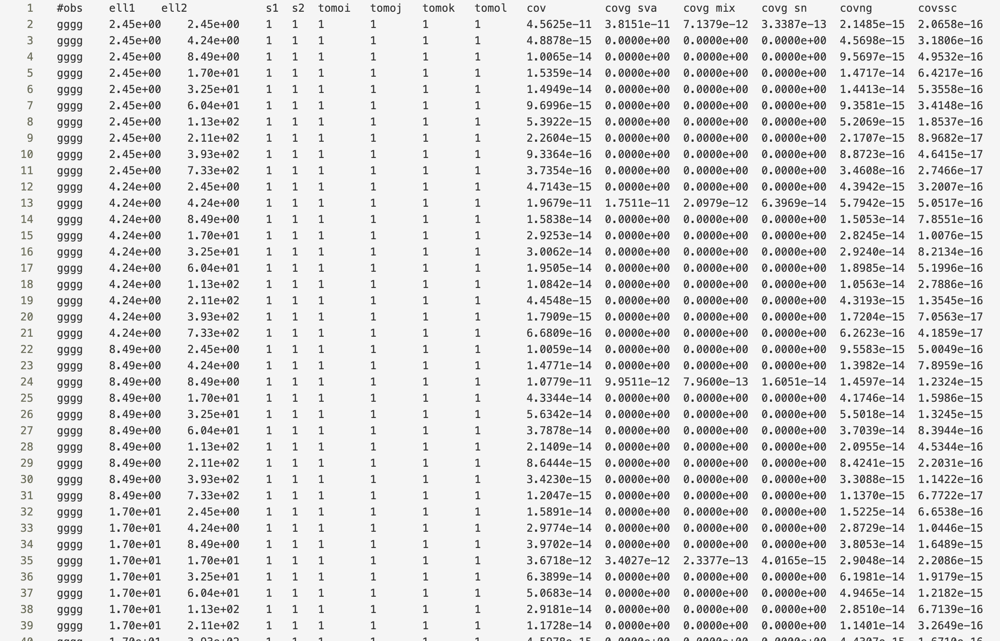
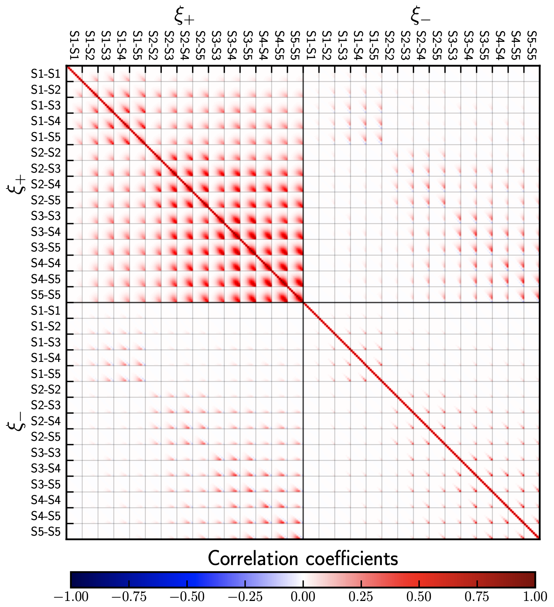
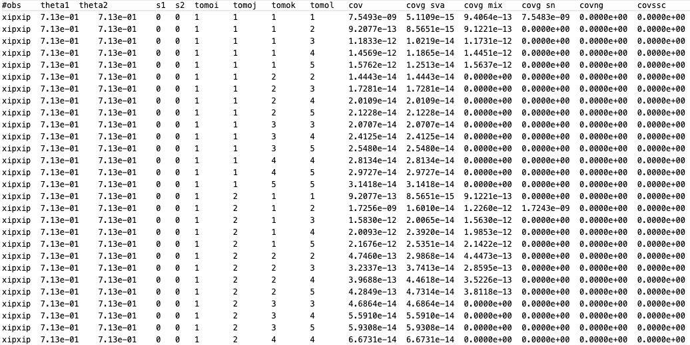

Some examples
=============

3x2pt for :math:`C_\ell`:
-------------------------
We will calculate the full 3x2pt covariance matrix in harmonic space by running the covariance code with the in ``config_3x2pt.ini`` in the ``/config_files`` directory.
To obtain a good understanding, we will go through the ``.ini`` file section by section:

::

   [covariance terms]
   gauss = True
   split_gauss = True
   nongauss = True
   ssc = True

These settings ensure that all terms in the covariance are calculated, that is the Gaussian, non-Gaussian and super-sample covariance terms. The option ``split_gauss = True`` results into
a further splitting of the Gaussian term into sample-variance, mixed and shot-noise terms in the list output. 

::
 
   [observables]
   cosmic_shear = True
   est_shear = C_ell
   ggl = True
   est_ggl = C_ell
   clustering = True
   est_clust = C_ell
   cstellar_mf = False
   cross_terms = True
   unbiased_clustering = False

Clearly we have switched on all observables and choose ``C_ell`` as the required summary statistic. Furthermore, ``unbiased_clustering`` is ``False`` since a bias model will
be used to describe the clustering. Since we do not require the stellar mass function, it is set to ``False``. Setting ``cross_terms = True`` ensures that all cross-covariances
between the observables are calculated. 

::

   [output settings]
   directory = ./output/
   file = covariance_list.dat, covariance_matrix.mat
   style = list, matrix
   list_style_spatial_first = True
   corrmatrix_plot = correlation_coefficient.pdf
   save_configs = save_configs.ini
   save_Cells = True
   save_trispectra = False
   save_alms = True
   use_tex = False

This section specifies the output setting and is in general pretty self-explanatory. It should be said, however, ``list_style_spatial_first = True`` will lead to the spatial index,
:math:`\ell` in this case, to vary fastest in the list output.  Furthermore, ``save_alms = True`` ensures that the suvey modes of the SSC term are
saved on disk if a mask file is specified. ``use_tex = False`` is just for cosmetics of the output plot, only switch it on if ``LaTeX`` is installed.

::

   [covELLspace settings]
   delta_z = 0.08
   tri_delta_z = 0.5
   integration_steps = 500
   nz_interpolation_polynom_order = 1
   mult_shear_bias = 0, 0, 0, 0, 0
  
   ell_min_clustering = 2
   ell_max_clustering = 1000
   ell_bins_clustering = 10
   ell_type_clustering = log

   ell_min_lensing = 2
   ell_max_lensing = 5000
   ell_bins_lensing = 15
   ell_type_lensing = log

Here are the most important settings for the :math:`C_\ell`: covariance, apart from a few accuracy settings the multipole ranges for clustering and lensing are specified.
It should be noted that GGL always assumes the binning for clustering due to the galaxy bias. Here the code will assume 10 equidistant bins (in log) between multipoles 10 and 1000.
Note that the centre of the first bin is therefore not :math:`\ell = 10`. The averaging over the multipoles is carried out internally. ``mult_shear_bias`` specifies the values for the
multiplicative shear bias uncertainty. Note that, if one uses input :math:`C_\ell` which contain already residual shear bias uncertainties, this should be set to zero. Here we deal with 5 lensing
bins and therefore specify 5 values.

::

   [survey specs]
   survey_area_clust_in_deg2 = 1100
   n_eff_clust = 0.16, 0.16
   survey_area_ggl_in_deg2 = 1100
   survey_area_lensing_in_deg2 = 777
   ellipticity_dispersion = 0.270211643434, 0.261576890227, 0.276513819228, 0.265404482999, 0.286084532469
   n_eff_lensing = 0.605481425815, 1.163822540526, 1.764459694692, 1.249143662985, 1.207829761642 

In this section the survey specifications are passed. We do not pass any mask file, so the survey area is just given in square degrees and the SSC term will use a circular mask with that area
to calculate the response. ``n_eff_clust``, ``n_eff_lensing`` and ``ellipticity_dispersion`` must always match the number of redshift bins passed in the ``redshift`` section.

::

   [redshift]
   z_directory = ./input/redshift_distribution
   zclust_file = BOSS_and_2dFLenS_n_of_z1_res_0.01.asc, BOSS_and_2dFLenS_n_of_z2_res_0.01.asc
   value_loc_in_clustbin = left
   zlens_file = K1000_photoz_1.asc, K1000_photoz_2.asc, K1000_photoz_3.asc, K1000_photoz_4.asc, K1000_photoz_5.asc
   value_loc_in_lensbin = left

Here the file paths of the redshift distributions are specified, both for clustering and lensing (note that in the literature clustering is often refereed to as lenses, or lens distribution, while 
lensing is referred to as sources or source distribution). The number (or structure) of these files will determine the number of tomographic bins for clustering, lensing and GGL. The clustering signal
will always be calculated for all unique bin combinations, even if there is no overlap between the clustering bins. ``value_loc_in_...`` specifies how the redshift values in the files should be interpreted,
i.e. whether they correspond to the ``left``, ``mid`` or ``right`` location of the redshift distribution histogram.

::
   
   [cosmo]
   sigma8 = 0.8
   h = 0.7
   omega_m = 0.3
   omega_b = 0.05
   omega_de = 0.7
   w0 = -1.0
   wa = 0.0
   ns = 0.965
   neff = 3.046
   m_nu = 0.0

The cosmology section just specifies the used cosmology, nothing surprising here. ``astropy`` is used for background calculations and ``hmf`` for the mass function and ``camb`` for matter power spectra.

::

   [bias]
   bias_files = ./input/bias/zet_dependent_bias.ascii

In this case the bias section is very simple as we are just passing a redshift dependent bias as stored in a file. You should make sure that the bias file covers the same redshift range as the redshift distribution files,
otherwise extrapolation will be used. Furthermore, make sure that the bias file structure matches the number of clustering bins.

::

   [IA]
   A_IA = 0.264
   eta_IA = 0.0
   z_pivot_IA = 0.3

The base alignment model in the OneCovariance code is the NLA model and it is implemented such that the alignment signal is always a linear response to the non-linear tidal field. Hence non-Gaussian and SSC terms will also
contain a small IA contribution.

::

   [halomodel evaluation]
   m_bins = 900
   log10m_min = 6
   log10m_max = 18
   hmf_model = Tinker10
   mdef_model = SOMean
   mdef_params = overdensity, 200
   disable_mass_conversion = True
   delta_c = 1.686
   transfer_model = CAMB
   small_k_damping_for1h = damped

This section defines the parameterswhich are required for halomodel evaluations and usually do not need any modifications. 

::

   [powspec evaluation]
   non_linear_model = mead2020
   HMCode_logT_AGN = 7.3
   log10k_bins = 200
   log10k_min = -3.49
   log10k_max = 2.15

Here the matter power spectrum parameters are defined. Note that the wavenumber range might be updated internally depending on the multipole range.
``non_linear_model`` specifies the nonlinear model used for the power spectrum and takes the same keywords as ``camb`` and thus ``cosmosis``.

::

   [trispec evaluation]
   log10k_bins = 100
   log10k_min = -3.49
   log10k_max = 2.
   matter_klim = 0.001
   matter_mulim = 0.001
   small_k_damping_for1h = damped
   lower_calc_limit = 1e-200

Specifies a few parameters for trispectrum calculation (if the non-Gaussian covariance is required), such as the wavenumber range on which it is evaluated.
Note that it will always be inter- and extrapolated onto the required wavenumber range for the projections.

::

   [tabulated inputs files]
   Cell_directory = ./input/Cell
   Cgg_file = Cell_gg.ascii
   Cgm_file = Cell_gkappa.ascii
   Cmm_file = Cell_kappakappa.ascii

For this case, we want to use external angular power spectra for the Gaussian covariance. These are passed from the directory ``./input/Cell`` for all required 
tracers. Make sure that these have the correct format, otherwise the code will complain.

::

   [misc]
   num_cores = 8

Lastly, we are running the whole code on 8 cores. Running

:: 
   
   python3 covariance.py config_files/config_3x2pt.ini

Will then execute the covariance and produce some terminal outputs notifying the user about the current process. As output two files will be generated. First the ``covariance_list.dat`` containing all elements
in a long list:

Since ``split_gauss = True`` was specified, the Gaussian terms are splitted into the different contributions. The first column labels the tracers, column 2 and 3 the spatial variable,
4 and 5 are the stellar mass sample bins (which is just one since no HoD was used) and column 6-9 label the tomographic bin combination associated with the tracers.
The ``cov`` column is the final covariance. The Gaussian covariance would be the sum of the columns ``covg sva``,	``covg mix`` and ``covg sn``, labeling sample variance, mixed term and shot noise respectively.
``covng`` is the non-Gaussian covariance and ``covssc`` the super-sample covariance. 
Furthermore, a matrix file, ``covariance_matrix.mat`` is produced whose general shape is described in the header and can generally be deduced by looking at the plot, ``correlation_coefficient.pdf``.

KiDS-1000 covariance
--------------------
The standard ``config.ini`` (after you pulled the directory) will run a simplified KiDS-1000-like cosmic shear setup. Not all parameters specified in the ``config.ini`` are used and it is merely used as an explanatory file to explain all the parameters which can be set.
Let us take a closer look at the output: Since a plot for the correlation coefficient was requested, we have:

With the corresponding covariance saved in ``covariance_matrix.mat``. A complete list of all the entries can be found in the ``covariance_list.dat`` file as shown below.

The first column specifies which combination of observables is considered, in this case :math:`\xi_{+}\xi_{+}`. The second and third column label the combination of the independent spatial variable of the corresponding summary statistic, here this are the two :math:`\theta` bins.
For bandpowers this would be the multipole bands and for COSEBIS the order. ``s1`` and ``s2`` label the sample bins in mass used (for the evaluation of the halo model integrals). ``tomoi``, ..., `tomol` are the tomographic bin combinations, which start counting at 1.
The total covariance is safed in the column ``cov``. If in the ``config.ini`` the variable ``split_gauss`` is set to true the Gaussian component of the covariance is split into a sample-variance, shot/shape noise and mix term labeled ``covg_sva``, ``covg_sn`` and ``covg_mix`` respectively.
Finally the last two columns show the non-Gaussian and the super-sample covariance term respecitvely, since they have been switched off in the ini-file they are set to zero.

We can calculate the covariance also for bandpowers and COSEBIs by setting:

``est_shear = bandpowers``

``est_shear = cosebi``

in the ini-file. Similarly the non-Gaussian and the super-sample covariance term can be requested by setting

``nongauss = True``

``ssc = True``

Using Input :math:`C_\ell`
--------------------------
In the directory ``input/Cell`` files for precomputed angular power spectra, :math:`C_\ell`, are provided. They should explain the required structure and can be passed to the code by setting

``Cell_directory = ./input``

``Cgg_file = Cell_gg.ascii``

``Cgm_file = Cell_gkappa.ascii``

``Cmm_file = Cell_kappakappa.ascii``

in the ini-file. In this way one can use the code to produce the covariance of the implemented summary statistic for any tracer for which a harmonic covariance has been calculated. 

