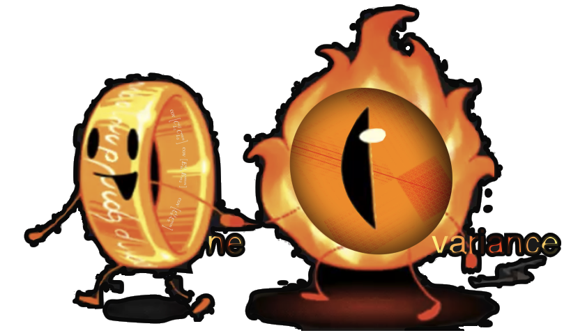

OneCovariance code by KiDS for kids and adults
===================================

The OneCovariance code is a python package to calculate covariance matrices
for observables of photometric large-scale structure surveys.

Contents
--------

.. toctree::
    :maxdepth: 1
    :caption: User Guide

    guides/installation
    guides/running
    guides/examples

.. toctree::
    :maxdepth: 1
    :caption: API Documentation

    api

Support
-------